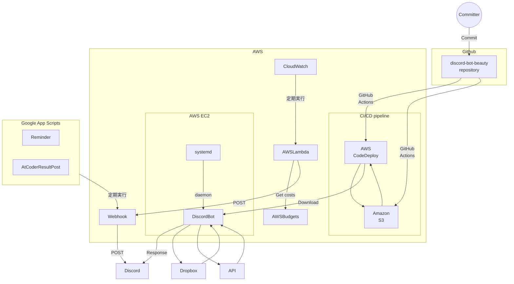

人様に見せられるようにした discordbot

# 構成

```mermaid
graph TD

committer((Committer))
repository[discord-bot-beauty\nrepository]
codedeploy[AWS\nCodeDeploy]
s3[Amazon\nS3]
bot[DiscordBot]

committer --> |Commit| repository
GAS[Google Apps Script] -->|定期実行| Webhook
Webhook --> |POST| Discord
bot --> |Response| Discord
bot --> Dropbox
Dropbox --> bot
bot --> API
API --> bot

subgraph Github
    repository
end

subgraph AWS
    repository --> |GitHub\nActions| codedeploy

    subgraph cicd[CI/CD pipeline]
        repository --> |GitHub\nActions| s3
        codedeploy --> s3
        s3 --> codedeploy
    end

    subgraph ec2[AWS EC2]
        codedeploy --> |Download| bot
        systemd --> |daemon| bot
    end

    CloudWatch --> |定期実行|AWSLambda
    AWSLambda --> |Get costs| AWSBudgets
    AWSLambda -->|POST| Webhook
end

subgraph GAS[Google App Scripts]
    Reminder
    AtCoderResultPost
end
```
